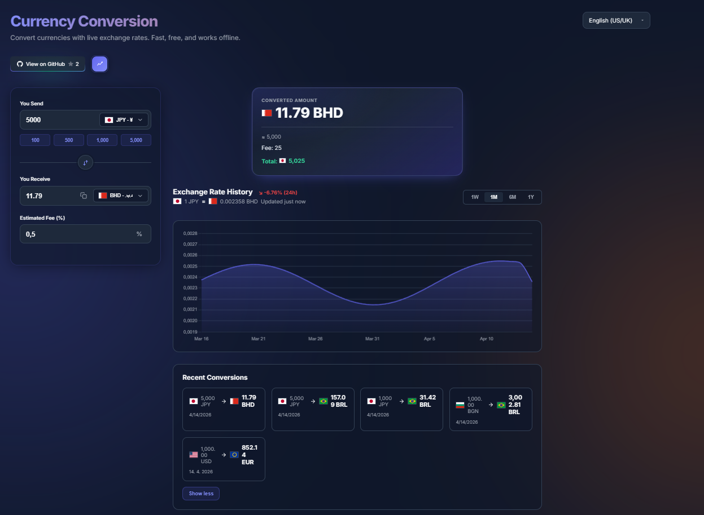
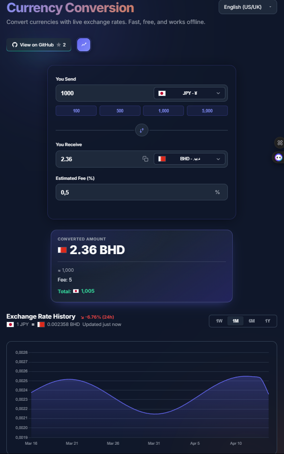

# Currency-Converter


[](https://finance-calculators-financial-tools.pages.dev/Calculators/Currency%20conversion/)


A modern, minimalist currency converter designed for fast and transparent conversions with real-time exchange rates.

[**Live Demo**](https://finance-calculators-financial-tools.pages.dev/Calculators/Currency%20conversion/) | [**License**](#license)

---

## Preview

### Desktop preview



### Phone preview



---

## Why I built this

Most currency converters online are either cluttered with ads, lack transparency (hidden fees), or feel outdated.

I wanted to create a tool that is **fast**, **clean**, and **transparent**, while showing users the **real cost of conversion**, not just the exchange rate.

---

## Key Features

* **Real-Time Currency Conversion:** Convert between 100+ currencies instantly.
* **Fee Transparency:** Displays estimated fees and total amount clearly.
* **Unified Result Box:** Clean and focused UI showing final result, fee, and total in one place.
* **Exchange Rate History:** Visual chart showing currency trends over time.
* **Recent Conversions:** Quickly access your last used conversions.
* **Favorites System (planned/optional):** Quickly select frequently used currencies.
* **Privacy First:** All calculations are performed locally in the browser.

---

## Additional Features

* **Auto Currency Detection:** Detects user's local currency automatically.
* **Language System:** Multi-language support with shared dropdown and auto-detection.
* **Responsive Design:** Fully optimized for mobile and desktop.
* **Modern UI/UX:** Minimalist fintech-inspired design with smooth interactions.

---

## Tech Stack

* **Frontend:** Vanilla HTML5, CSS3, JavaScript (ES6+)
* **Hosting:** Cloudflare Pages
* **Design:** Minimalist modern fintech UI

---

## How to use

1. **Online:** Visit the [Live Demo](https://finance-calculators-financial-tools.pages.dev/Calculators/Currency%20conversion/)
2. **Locally:**

   * Clone the repository:

     ```bash
     git clone https://github.com/robajzsek-a11y/Finance-Calculators-Financial-Tools.git
     ```
   * Open:

     ```
     Calculators/Currency conversion/index.html
     ```

---

## Contributing

Contributions, ideas, and improvements are welcome.
Feel free to open an issue or submit a pull request.

---

## ⭐ Like this project?

If you find it useful, give it a star on GitHub!

---

## License

This project is licensed under the **Creative Commons Attribution-NonCommercial-ShareAlike 4.0 International (CC BY-NC-SA 4.0)**.
See the [LICENSE](LICENSE.md) file for more details.

---

*Created with 🍊 by Pomerancee / Robajzs*
